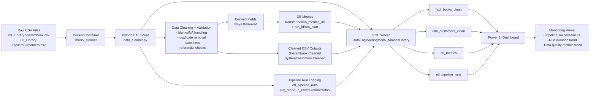

I need to have:

A presentation (markdown) for the data cleaning app that includes:

* Architecture Diagram
* Proposed Solution
* A PowerBi Dashboard that tracks the pipeline runs along with at least 3 Data engineering metrics
* Demo
* Risks & Issues
* SWOT Analysis
* Stretch: Demo/Test Docker Swarm and explain how this would fit into the above

## Architecture Diagram

